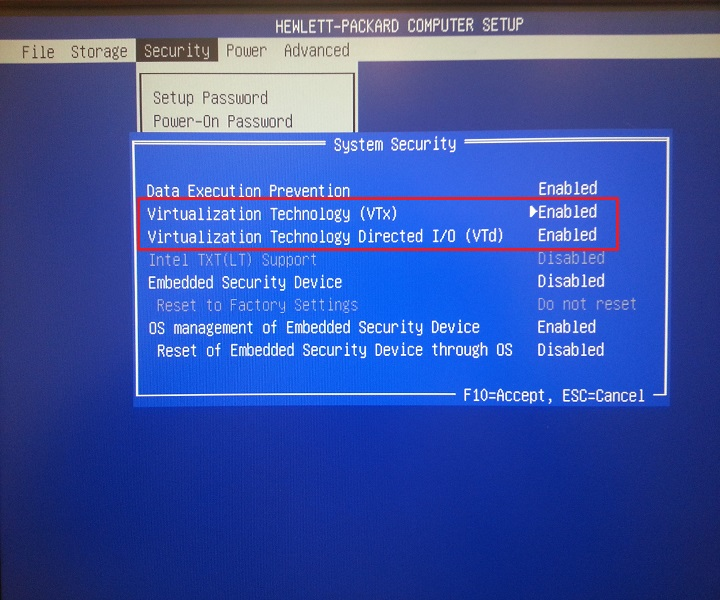
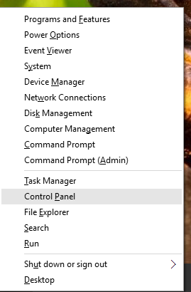
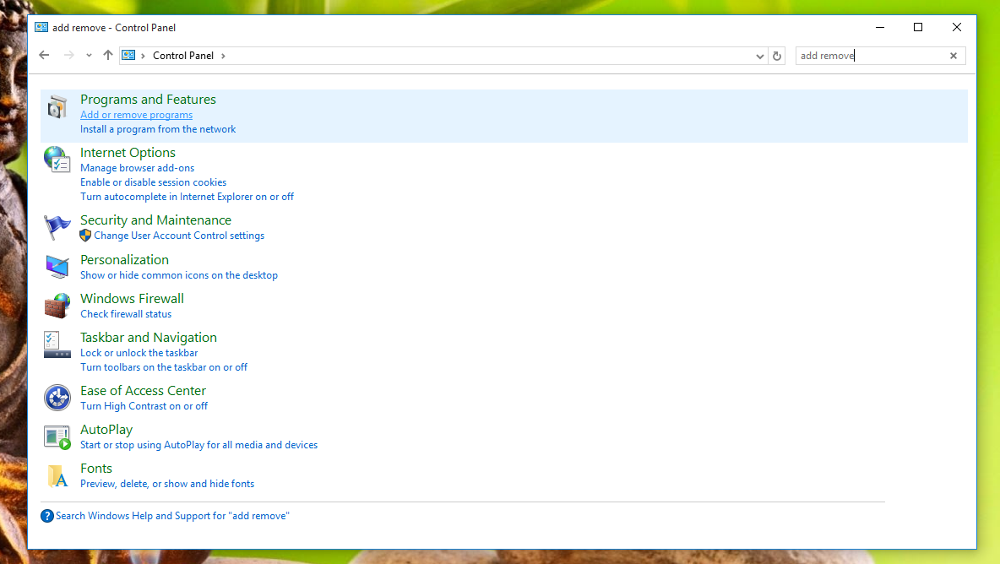
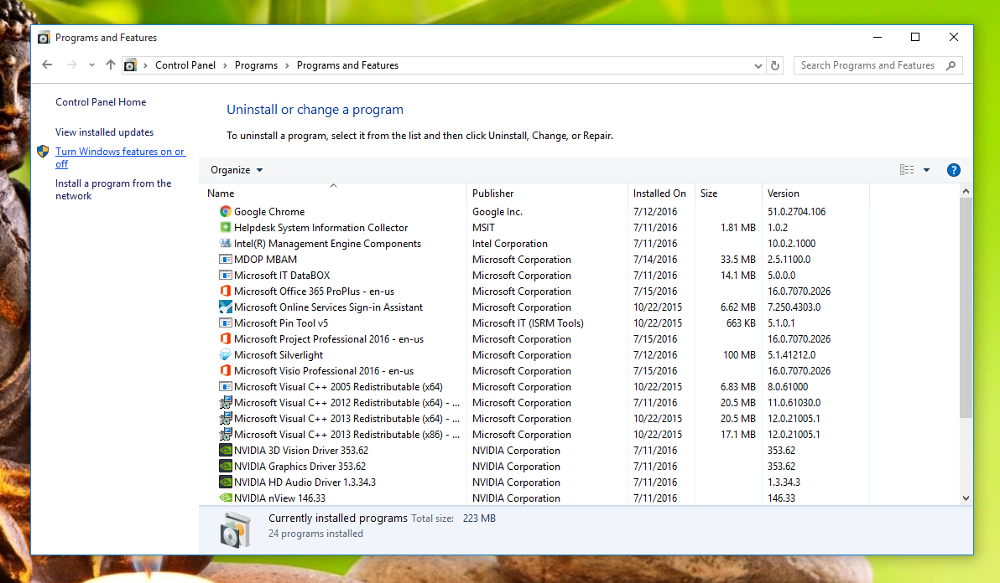
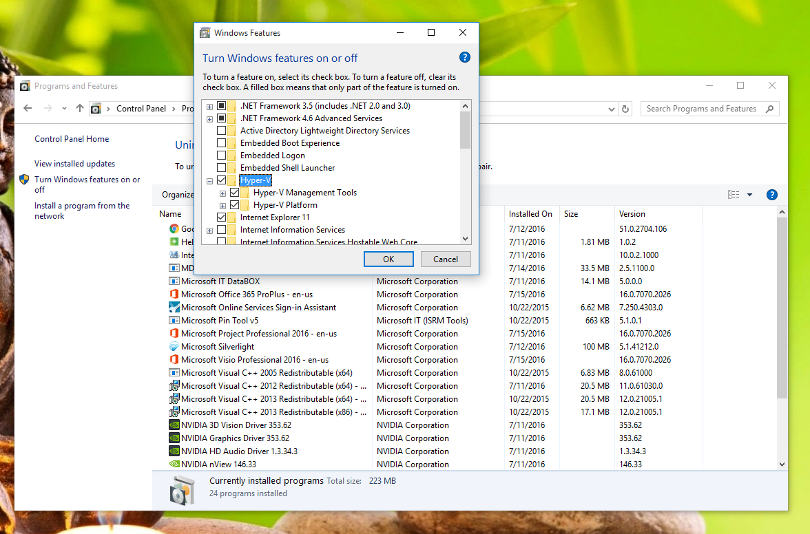
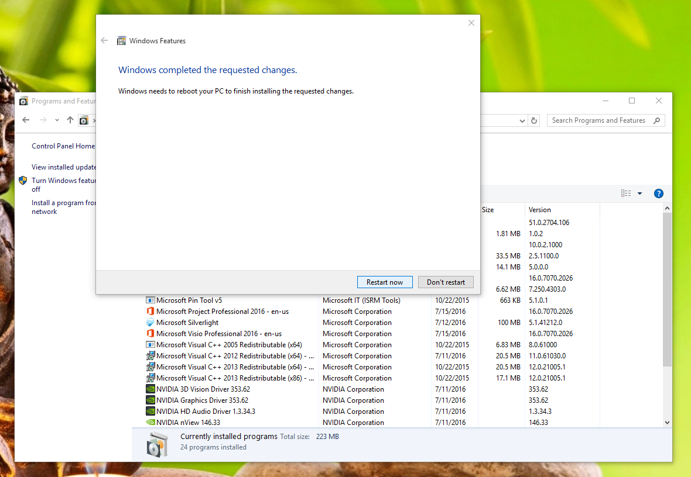
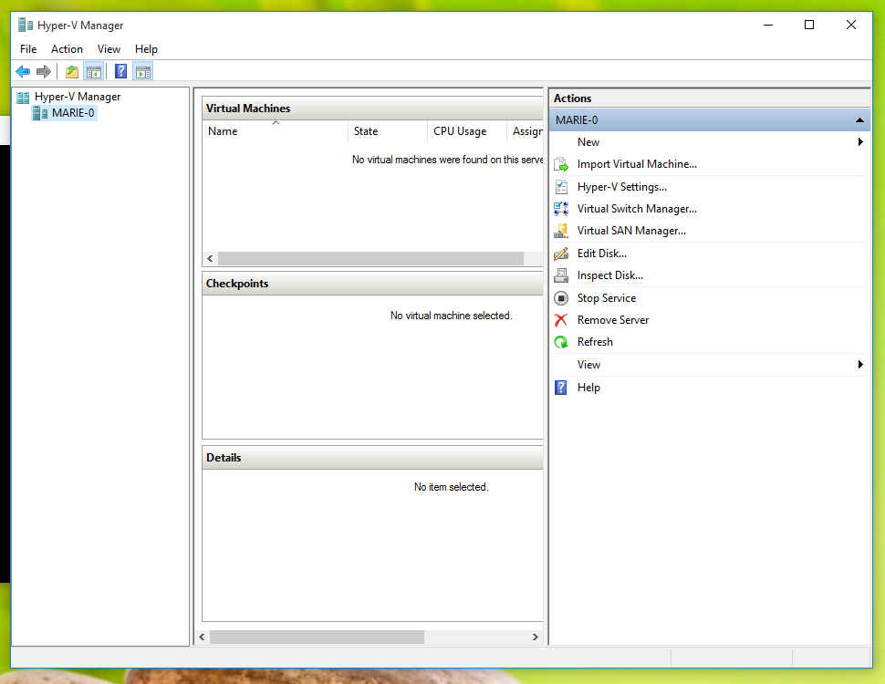
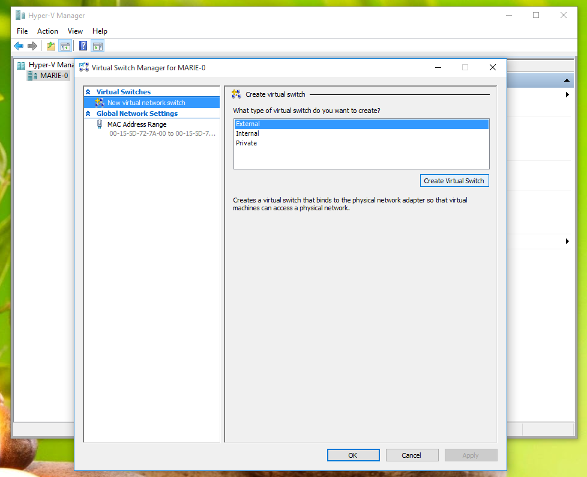
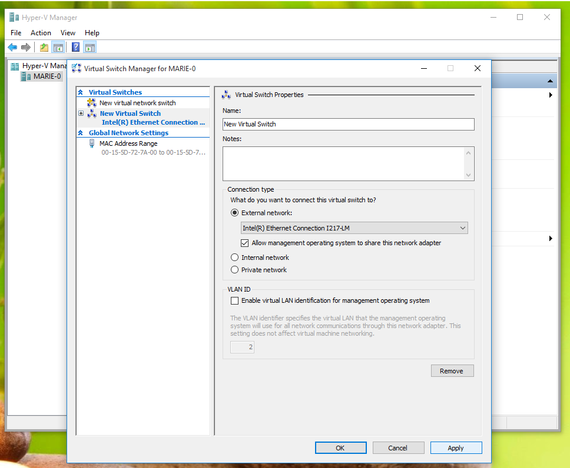
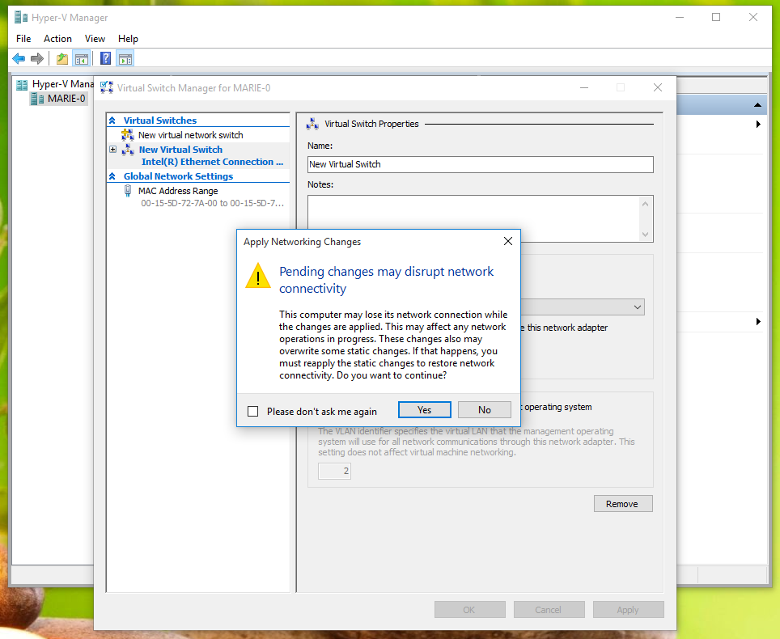

- Reboot and enter BIOS setup and make sure VTx and VTd are both enabled

  

- Press Win-X to bring up quick menu and choose Control Panel

  

- Enter ```add remove`` in search control and click "Add or remove programs" link

  
  
- Click "Turn Windows features on or off" link on left side of window

  

- Check Hyper-V and all of its children nodes

  

- Click "Restart now"

  

- Launch Hyper-V Manager, click your machine name in the tree on the left and select Virtual Switch Manager from the Action menu.

  

- Make sure External is selected and click Create Virtual Switch

  

- Name the switch anything you like and press Apply

  

  *Be sure that your virtual switch is bound to a connected physical adapter. If the adapter your VM is bound to is not connected then vagrant may timeout without connecting. This requirement is applicable to any automatically created virtual network switches as well.*
  
- Click Yes to interupt your network, it's worth it.

  

